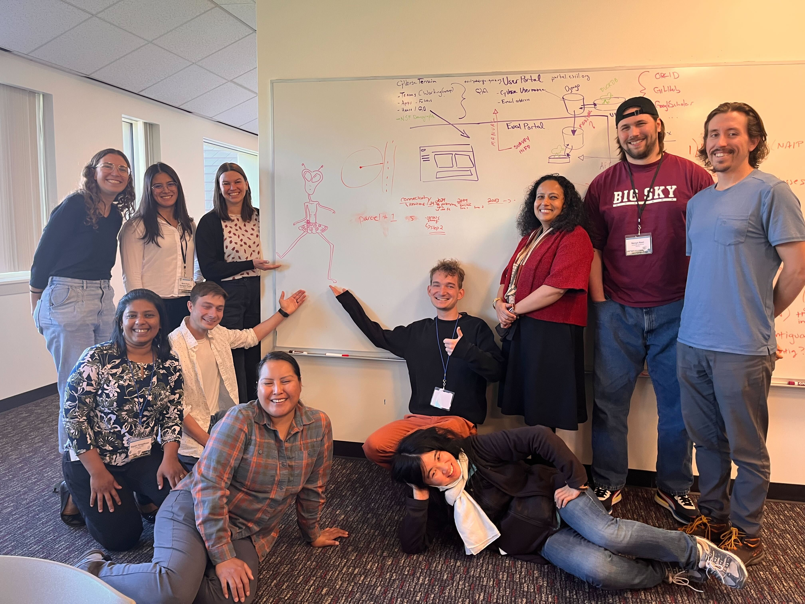

# Transformations & Ecosystem Services Innovation Summit 2025 — Team 11

<a href="https://github.com/CU-ESIIL/transformations-ecosystem-services-innovation-summit-2025__11/edit/main/docs/index.md" title="Edit this page">✏️</a>

<!-- =========================================================
HERO (Swap hero.jpg, title, strapline, and the three links)
========================================================= -->

*Figure 1*: [BLM/Heather Feeney]
BLM/Heather Feeney.

# Our product 📣
We will conduct a case study on a specific ecosystem to explore how implementation of the RAD management framework affects different ecosystem services (and thus different stakeholders) in various ways. We will use the information gathered through this case study as an input into a model to predict how prioritization of certain ecosystem services may demand different approaches within the RAD framework. Our product will be a static markdown document that describes our case study and the findings of that exploration as well as the development and outcomes of the model. We will include a code repository with the document.

# Our question 📣
**What are the predicted ecological outcomes post-disturbance when adopting RAD management actions in sagebrush ecosystems?**

# Hypotheses / intentions
**H1: Biomass will not be negatively affected (i.e. decrease) independent of the implemented RAD action.**

**H2: Biomass of specific plant species will change depending on the RAD action. Specifically: the highest biomass of sagebrush, native grass and cheatgrass will occur in the R, D and A treatments, respectively.** 

## List of parameters

*Figure 2: Conceptual diagram of potential applications of the RAD framework to the Sagebrush ecosystem. Sagebrush image credit: Oregon State University*

### Background on the Sagebrush Ecosystem
The sagebrush ecosystem is widely distributed in the United States, with Artemisia tridentata Nutt. being the dominant species (Schlaepfer et al., 2012). Over 350 plants and animals that depend on this ecosystem are or have been recognized as endangered; for example sage-grouse (Centrocerus urophasianus) (Davies et al., 2011) Sagebrush plants are important for nutrient accumulation in the soil, which is important for understory species (Harris et al., 2024), as well as for regulation of the hydrologic cycle in the dry regions where it occurs (Schlaepfer et al., 2012). However, this biome faces numerous pressures despite coinciding with a not very developed region (e.g. Western vs. Eastern US; Doherty et al., 2024).

The threats faced by the sagebrush ecosystem include invasion of cheatgrass (Bromus tectorum L.) and conifers (Juniperus and Pinus spp.), wildfire, drought, and agricultural and livestock activities (Doherty et al., 2024). These threats interact with each other; for example, invasive species act as “fuel load” that increases the risk of fires (Chambers et al., 2014). Considering future climatic scenarios, recent simulations have shown that reductions in ecological integrity of this ecosystem are more expected than potential increases, and that climate change will amplify the negative effects caused by invasive species and wildfires (Holdrege et al., 2024). In fact, decrease in ecological integrity is more likely in dry and warm areas than in cool and wet sites (Holdrege et al., 2024). All these threats reduce the ecological integrity of sagebrush and jeopardize the services it provides (Doherty et al., 2024). When specific abiotic thresholds are crossed, the sagebrush-steppe biome transitions into 1) cheatgrass ecosystems dominated by weed dominance or 2) juniper-pynion dominated woodlands with depletion of understory vegetation (Chambers et al., 2014; Evers et al., 2013).

Previously, numerous actions towards conserving sage-grouse helped to mitigate different stressors on this ecosystem, but a more recent shift from species (sage-grouse) to biome (sagebrush) conservation has started (Doherty et al., 2024). This led to the Sagebrush Conservation Design, which is part of the biome-wide Sagebrush Conservation strategy that categorized regions within the sagebrush’s distribution as Core (intact and ecologically functional), Growth (relatively functional but impacted by a few threats) and Other (heavily impacted) Areas in order to implement effective  and proper management actions accordingly (Doherty et al., 2024). The main focus of this Conservation Design is to prioritize the preservation of Core Areas through preemptive actions, whereas actions to manage and/or restore impacted regions comes next. Under the RAD framework, this stance corresponds to a resist-type management, where actions align with maintaining the current and ideal state (Dunham et al., 2022) of preserving the greatest cover of sagebrush and native herbaceous species in the ecosystem. In the case of invasive species like cheatgrass and juniper, the predominant management actions directed to resist have included its suppression via prescribed burning and/or mechanical removal (Chambers et al., 2014; Evers et al., 2013). Other strategies like reseeding of desired species to decrease invasives’ dominance or after disturbances (e.g. fires) has also been conducted (Evers et al., 2013). 

Nevertheless, in a changing world where many ecosystem transformations will be inevitable or challenging to counteract due to predicted trends (e.g. climate change), the accept and direct trajectories of the RAD framework open the door to think and consider more flexible management actions that acknowledge what is possible in the upcoming future (Dunham et al., 2022; Rahel et al., 2022). In the case of sagebrush, potential alternatives include accepting the ecosystem transitions (e.g. not suppressing invasive species or improving other abiotic conditions like soil quality while allowing the expansion of invasives) or directing the ecosystem towards new, accepted states (e.g. seeding sagebrush varieties better adapted to fires/more environmental resilient, seeing other native herbaceous species to transition to desired grasslands).

# Why this matters (the "upshot") 📣

In a changing world many environmental transformations will be inevitable or very challenging to avoid, so management approaches should embrace alternative actions other than resisting.  In other words, adopting a RAD framework can enable more flexibility regarding future environmental outcomes in a changing world. Based on this, we will focus on the sagebrush ecosystem with the aim of comparing how plant biomass may change in future warmer climate scenarios when implementing different actions under the RAD framework. The current state of this ecosystem is a dominant sagebrush cover, but because alternative states are possible following disturbance (e.g. conversion to cheatgrass or native grass dominated ecosystems), we are focusing on overall biomass as it represents an important ecosystem service despite change.

---

## Day 2 — Data & Methods
*The sagebrush biome is MASSIVE.*

*Figure 2:The sagebrush biome is outlined in blue here. Annual grass cover % is shown here, from low (green) to high (red). Image credit: [Rangeland Analysis Platform (RAP) Partner Tool: Cheatgrass](https://conservation-maps.wlfw.org/?sg_biome_v=true&ll=42.4017,-125.4102&z=5&basemap=hybrid&sg_biome_o=0.99&scd_o=1&tab=0&gp_biome_ext_v=true&ann_hc_v=true)*

### Data sources we're exploring 📣 
<!-- EDIT: Link each source; add size/notes if relevant. -->
| Category | Source | Temporal Range | Spatial Resolution |
|----------|--------|----------------|-------------------|
| Vegetation Cover | [RCMAP (USGS/NLCD)](https://www.mrlc.gov/data?cookiesession8341=0DA6D8B667926AE7FF45A7A41D2481BC) | 1985-2024 | 30m |
| Vegetation Cover | - Perennial grasses | Annual | 30m |
| Vegetation Cover | - Annual grasses | Annual | 30m |
| Vegetation Cover | - Sagebrush | Annual | 30m |
| Climate | [CHC-CMIP6](https://www.chc.ucsb.edu/data/chc-cmip6) | SSP245 (2030-2050) | 5km |
| Stakeholders | [Bureau of Land Management (BLM) Surface Management Data](https://gbp-blm-egis.hub.arcgis.com/datasets/BLM-EGIS::blm-ut-surface-management-agency-polygon/about) | N/A | N/A |
| Management Treatment | [Treatment and Wildfire Interagency Geodatabase (TWIG)](https://reshapewildfire.org/resources/twig-data-resources) | 2000-2025 | acre |

### Methods / technologies we’re testing 📣
**(1) Choose a study region**

*Figure 3: Defend the core, grow the core conceptual figure. This strategy, proposed by the USDA-NRCS, suggests focusing management actions on in-tact core areas and expanding sage into growth areas. Image credit: [USDA-NRCS](https://www.wlfw.org/publication-alert-defend-the-core-maintaining-intact-rangelands-by-reducing-vulnerability-to-invasive-annual-grasses/)*

*Figure 4: Sagebrush Conservation Design Core-Growth-Other classess for our study area. 'Core' represents in-tact sagebrush habitat, 'Grow' represents slightly degraded habitat where management actions for expanding sage habitat can be focused.*

**(2) Characterize the study region**
- ### Vegetation community
  
  *Figure 5: Vegetation cover of the study area from RCMAP cover classes.*
- ### Climate
- ### Precipitation 
  
  *Figure 6: Summer precipitation (June-August, in mm) for our study area, predicted for 2031-2060 using the SSP4.5 scenario using [climatetoolbox.org](https://climatetoolbox.org/tool/Climate-Mapper)*

 - ### Temperature
  
  *Figure 7: Annual maximum temperatrure (degrees C) for our study area, predicted for 2031-2060 using the SSP4.5 scenario using [climatetoolbox.org](https://climatetoolbox.org/tool/Climate-Mapper)*

- ### Managament
  
  *Figure 8: TWIG Data Viewer, mamagement polygons for our study area. Data source: [TWIG Interactive Data Viewer](https://reshapewildfire.org/twig/layers?treatmentRendererId=f7da47bfbb4245b68871fa13acbf3723)*

  
  *Figure 9: Percent Sagebrush Cover 1985 and 2024 from RCMAP data.*
  
  
  
  *Figure 10: TWIG treatments for out study area impact on Sage cover.*

- ### Stakeholders  
  
  *Figure 11: Surface Management Areas (SMA) for the study region. Our sage habitat is primarily managed by the State of Utah and the Bureau of Land Management (BLM). Data source: [BLM Utah Interactive Web Map](https://blm-egis.maps.arcgis.com/apps/instant/sidebar/index.html?appid=e84f92a84afb44b1ad7f65984332b4f2)*

**(3) Model RAD management scenarios across the study region** 
(Sam or Nick write section about JOSH + Claude)
- **Resist** strategies:
- **Accept** strategies:
- **Direct** strategies:

#### Interactive map - Study Area Centroid
<iframe
  title="Study area (OpenStreetMap)"
  src="https://www.openstreetmap.org/export/embed.html?bbox=-111.8558118962267%2C38.32357762768794%2C-111.8558118962267%2C38.32357762768794&layer=mapnik&marker=38.32357762768794%2C-111.8558118962267"
  width="100%" height="360" frameborder="0"></iframe>

<a href="https://www.openstreetmap.org/?mlat=38.32357762768794&mlon=-111.8558118962267#map=12/38.32357762768794/-111.8558118962267">Open full map</a>

---

## Final Share Out — Insights & Sharing 

*RAD- US! Us is all these people!*

### Findings at a glance 📣
<!-- EDIT: 2–4 bullets, each a headline in plain language with a number if possible. -->
- Case Study Finding: We observed a variety of management agenecies and strategies across the sagebrush ecosystem. A data cube that synthesizes a variety of the sagebrush ecosystem data would be a useful input into the JOSH model. 
- Model Finding: We should empower those on the ground to blend approaches across RAD but where modeling can be made available rapidly to offer confidence in those decisions.

Accepting is acceptable but blended offers the most robust benefits acorss carbon and native establishment.

### Challenges / Limitations

_timing_ - we aspired to meet more in the middle between case study and actual modelling applications:
- RE: transition probabilities, management scenarios, didn't arrive at our resultant ideas early enough - for example - decadent stand <-> naiive sagebrush removal
- similarly some misapplication of management application (thinning targeting cheatgrass rather than `decadent` sagebrush)

_validation_ - based on LTER line transects within target area, based on spectral unmixing, based on ... ? How can we validate our model outcomes, responsibly?

_parameterization_ - super-abbreviated and claude-accelerated lit review of transition probabilities and other patch-based model dynamics - *much more of an emphasis on teasing out differences in management outcomes rather than internal ecological validity*

### Caveats

**These should not be interpreted as management implications.**

**in general - our hope is to use our tool to help managers tease out the nuance within the D aspect of RAD - especially in situations where novel fire regimes / invasions / climate scenarios make management a challenging out-of-sample prediction problem.**

## Team
| Name | Sub Group | 
|------|------|
| Julie | Modeling |
| Nevyn | Modeling |
| Sam T | Case |
| Nayani | Case |
| Courtney | Case |
| Maria | Case |
| Nick | Modeling |
| Sam | Modeling |
| Helen | Case |
| Kusum | Modeling |

---

## Storage

Code
Keep shared scripts, notebooks, and utilities in the [`code/`](https://github.com/CU-ESIIL/Project_group_OASIS/tree/main/code) directory. Document how to run them in a README or within the files so teammates and visitors can reproduce your workflow.

Documentation
Use the [`docs/`](https://github.com/CU-ESIIL/Project_group_OASIS/tree/main/docs) folder to publish project updates on this site. Longer internal notes can live in [`documentation/`](https://github.com/CU-ESIIL/Project_group_OASIS/tree/main/documentation); summarize key takeaways here so the public story stays current.

---

## Cite & reuse
If you use these materials, please cite:

> Lastname, A., Lastname, B. (2025). *Project title*. DOI or URL.

License: CC-BY-4.0 unless noted. See dataset licenses on the **[Data](data.md)** page.

---

<!-- EDIT HINTS
- Upload images to docs/assets/ and reference as assets/filename.png
- Keep images ~1200 px wide; avoid >5–8 MB per file.
- Use short, active sentences; this is a scrolling “slide deck.”
- Update this page at least once per day during the sprint.
-->

