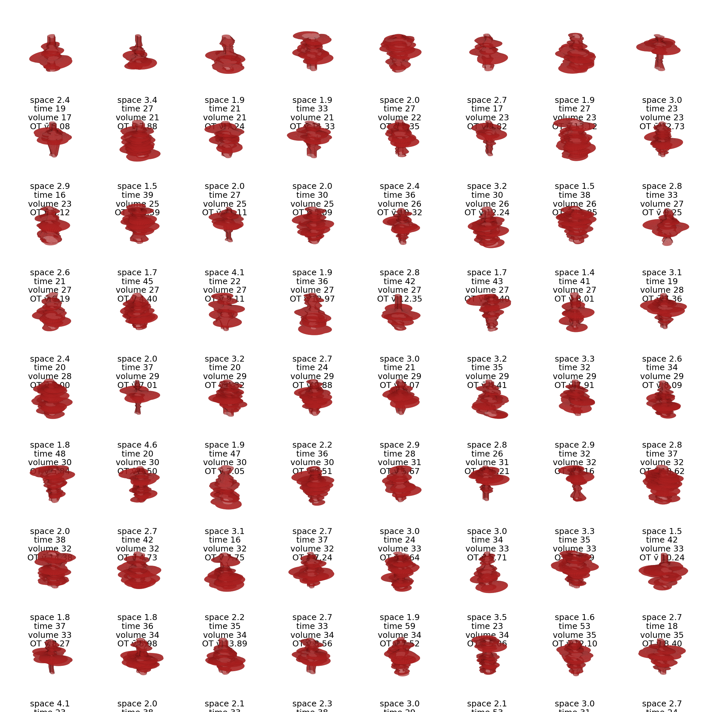

# Transformations & Ecosystem Services Innovation Summit 2025 — Team 11

<a href="https://github.com/CU-ESIIL/transformations-ecosystem-services-innovation-summit-2025__11/edit/main/docs/index.md" title="Edit this page">✏️</a>

<!-- =========================================================
HERO (Swap hero.jpg, title, strapline, and the three links)
========================================================= -->

*Figure 1*: [BLM/Heather Feeney]
BLM/Heather Feeney.

# Our product 📣
We will conduct a case study on a specific ecosystem to explore how implementation of the RAD management framework affects different ecosystem services (and thus different stakeholders) in various ways. We will use the information gathered through this case study as an input into a model to predict how prioritization of certain ecosystem services may demand different approaches within the RAD framework. Our product will be a static markdown document that describes our case study and the findings of that exploration as well as the development and outcomes of the model. We will include a code repository with the document.

# Our question 📣

What are the predicted ecological outcomes post-disturbance when adopting RAD management actions in sagebrush ecosystems?

# Hypotheses / intentions
In a changing world many environmental transformations will be inevitable or very challenging to avoid, so management approaches should embrace alternative actions other than resisting.  In other words, adopting a RAD framework can enable more flexibility regarding future environmental outcomes in a changing world. Based on this, we will focus on the sagebrush ecosystem with the aim of comparing how plant biomass may change in future warmer climate scenarios when implementing different actions under the RAD framework. The current state of this ecosystem is a dominant sagebrush cover, but because alternative states are possible following disturbance (e.g. conversion to cheatgrass or native grass dominated ecosystems), we are focusing on overall biomass as it represents an important ecosystem service despite change.

**H1: Biomass will not be negatively affected (i.e. decrease) independent of the implemented RAD action.**

**H2: Biomass of specific plant species will change depending on the RAD action. Specifically: the highest biomass of sagebrush, native grass and cheatgrass will occur in the R, D and A treatments, respectively.** 

## List of parameters

*Figure 1: Conceptual diagram of possibilities for applying RAD in a sagebrush ecosystem.*
  
Brainstorming treatments:
R: Herbicide/removal of invasive + reseeding sagebrush
A: Do nothing
D: Mechanical removal of sagebrush

(Intention and hypothesis) Better management decisions are made when starting from RAD. 😬

# Why this matters (the "upshot") 📣

In a changing world many environmental transformations will be inevitable or very challenging to avoid, so management approaches should embrace alternative actions other than resisting.  In other words, adopting a RAD framework can enable more flexibility regarding future environmental outcomes in a changing world. Based on this, we will focus on the sagebrush ecosystem with the aim of comparing how plant biomass may change in future warmer climate scenarios when implementing different actions under the RAD framework. The current state of this ecosystem is a dominant sagebrush cover, but because alternative states are possible following disturbance (e.g. conversion to cheatgrass or native grass dominated ecosystems), we are focusing on overall biomass as it represents an important ecosystem service despite change.

---

## Day 2 — Data & Methods
*The sagebrush biome is MASSIVE.*

*Figure 2:The sagebrush biome is outlined in blue here. Annual grass cover % is shown here, from low (green) to high (red). Image credit: [Rangeland Analysis Platform (RAP) Partner Tool: Cheatgrass](https://conservation-maps.wlfw.org/?sg_biome_v=true&ll=42.4017,-125.4102&z=5&basemap=hybrid&sg_biome_o=0.99&scd_o=1&tab=0&gp_biome_ext_v=true&ann_hc_v=true)*

### Data sources we're exploring 📣 
<!-- EDIT: Link each source; add size/notes if relevant. -->
| Category | Source | Temporal Range | Spatial Resolution |
|----------|--------|----------------|-------------------|
| Vegetation Cover | [RCMAP (USGS/NLCD)](https://www.mrlc.gov/data?cookiesession8341=0DA6D8B667926AE7FF45A7A41D2481BC) | 1985-2024 | 30m |
| Vegetation Cover | - Perennial grasses | Annual | 30m |
| Vegetation Cover | - Annual grasses | Annual | 30m |
| Vegetation Cover | - Sagebrush | Annual | 30m |
| Climate | [CHC-CMIP6](https://www.chc.ucsb.edu/data/chc-cmip6) | SSP245 (2030-2050) | 5km |
| Stakeholders | [Bureau of Land Management (BLM) Surface Management Data](https://gbp-blm-egis.hub.arcgis.com/datasets/BLM-EGIS::blm-ut-surface-management-agency-polygon/about) | N/A | N/A |
| Management Treatment | [Treatment and Wildfire Interagency Geodatabase (TWIG)](https://reshapewildfire.org/resources/twig-data-resources) | 2000-2025 | acre |

### Methods / technologies we’re testing 📣
**(1) Choose a study region**

*Figure 3: Defend the core, grow the core conceptual figure. This strategy, proposed by the USDA-NRCS, suggests focusing management actions on in-tact core areas and expanding sage into growth areas. Image credit: [USDA-NRCS](https://www.wlfw.org/publication-alert-defend-the-core-maintaining-intact-rangelands-by-reducing-vulnerability-to-invasive-annual-grasses/)*

*Figure 4: Sagebrush Conservation Design Core-Growth-Other classess for our study area. 'Core' represents in-tact sagebrush habitat, 'Grow' represents slightly degraded habitat where management actions for expanding sage habitat can be focused.*

**(2) Characterize the study region**
- ### Vegetation community
  
  *Figure 5: Vegetation cover of the study area from RCMAP cover classes.*
- ### Climate
- ### Precipitation 
  
  *Figure 6: Summer precipitation (June-August, in mm) for our study area, predicted for 2031-2060 using the SSP4.5 scenario using [climatetoolbox.org](https://climatetoolbox.org/tool/Climate-Mapper)*

 - ### Temperature
  
  *Figure 7: Annual maximum temperatrure (degrees C) for our study area, predicted for 2031-2060 using the SSP4.5 scenario using [climatetoolbox.org](https://climatetoolbox.org/tool/Climate-Mapper)*

- ### Managament
  
  *Figure 8: TWIG Data Viewer, mamagement polygons for our study area. Data source: [TWIG Interactive Data Viewer](https://reshapewildfire.org/twig/layers?treatmentRendererId=f7da47bfbb4245b68871fa13acbf3723)*

  
  *Figure 9: Percent Sagebrush Cover 1985 and 2024 from RCMAP data.*
  
  
  
  *Figure 10: TWIG treatments for out study area impact on Sage cover.*

- ### Stakeholders  
  
  *Figure 11: Surface Management Areas (SMA) for the study region. Our sage habitat is primarily managed by the State of Utah and the Bureau of Land Management (BLM). Data source: [BLM Utah Interactive Web Map](https://blm-egis.maps.arcgis.com/apps/instant/sidebar/index.html?appid=e84f92a84afb44b1ad7f65984332b4f2)*

**(3) Model RAD management scenarios across the study region** 
(Sam or Nick write section about JOSH + Claude)
- **Resist** strategies:
- **Accept** strategies:
- **Direct** strategies:

### Challenges identified
- We are characterizing a very complex system in < 12 hours.
- etc.

### Visuals
<!-- EDIT: Swap examples; keep file sizes modest. -->

#### Static figure
Background figures
- Stakeholders (nate)
- Sage cover (Nayani + Julie)
- Climate (nate)
Modeling figures
- 100% for each management strategy (Sam)
- Combination (Sam)

#### Animated change (GIF)
- Video of model running (Sam)

#### Interactive map - Study Area Centroid
<iframe
  title="Study area (OpenStreetMap)"
  src="https://www.openstreetmap.org/export/embed.html?bbox=-111.8558118962267%2C38.32357762768794%2C-111.8558118962267%2C38.32357762768794&layer=mapnik&marker=38.32357762768794%2C-111.8558118962267"
  width="100%" height="360" frameborder="0"></iframe>

<a href="https://www.openstreetmap.org/?mlat=38.32357762768794&mlon=-111.8558118962267#map=12/38.32357762768794/-111.8558118962267">Open full map</a>

---

## Final Share Out — Insights & Sharing 
*Focus: synthesis; highlight 2–3 visuals that tell the story; keep text crisp. Practice a 2-minute walkthrough of the homepage 📣: Why → Questions → Data/Methods → Findings → Next.*

### Findings at a glance 📣
<!-- EDIT: 2–4 bullets, each a headline in plain language with a number if possible. -->
- Headline 1 — what, where, how much
- Headline 2 — change/trend/contrast
- Headline 3 — implication for practice or policy

### Visuals that tell the story 📣
<!-- EDIT: Swap visuals; prioritize clarity. -->

**We should empower those on the ground to blend approaches across RAD but where modeling can be made available rapidly to offer confidence in those decisions.**

Accepting is acceptable but blended offers the most robust benefits acorss carbon and native establishment.

[Raw photo location: fire_hull.png](https://github.com/CU-ESIIL/Project_group_OASIS/blob/main/docs/assets/fire_hull.png)
*Visual 1.* Swap in the primary graphic that clearly communicates your core takeaway.

[Raw photo location: hull_panels.png](https://github.com/CU-ESIIL/Project_group_OASIS/blob/main/docs/assets/hull_panels.png)
*Visual 2.* Use a complementary panel, collage, or set of snapshots that reinforces supporting evidence.

[Raw photo location: main_result.png](https://github.com/CU-ESIIL/Project_group_OASIS/blob/main/docs/assets/main_result.png)
*Visual 3.* Highlight an additional visual that captures a secondary insight or next step.

<iframe
  title="Short explainer video (optional)"
  width="100%" height="360"
  src="https://www.youtube.com/embed/ASTGFZ0d6Ps"
  frameborder="0" allow="accelerometer; autoplay; clipboard-write; encrypted-media; gyroscope; picture-in-picture; web-share"
  allowfullscreen></iframe>

### What’s next? 📣
- Immediate follow-ups
- What we would do with one more week/month
- Who should see this next

---

## Featured links (image buttons)
<!-- EDIT: Replace images/links; keep alt text meaningful and motion subtle. -->
<table>
<tr>
<td align="center" width="33%">
  <a href="assets/Seven%20ways%20to%20measure%20fire%20polygon%20velocity-4.pdf"> <strong>Read the brief</strong></a>
</td>
<td align="center" width="33%">
  <a href="https://github.com/CU-ESIIL/Project_group_OASIS/blob/main/code/fired_time_hull_panel.ipynb"> <strong>View code</strong></a>
</td>
<td align="center" width="33%">
  <a href="https://github.com/CU-ESIIL/Project_group_OASIS/blob/main/code/single_hull_demo.py"> <strong>Explore data</strong></a>
</td>
</tr>
</table>

---

## Team
| Name | Sub Group | 
|------|------|
| Julie | Modeling |
| Nevyn | Modeling |
| Sam T | Case |
| Nayani | Case |
| Courtney | Case |
| Maria | Case |
| Nick | Modeling |
| Sam | Modeling |
| Helen | Case |
| Kusum | Modeling |

---

## Storage

Code
Keep shared scripts, notebooks, and utilities in the [`code/`](https://github.com/CU-ESIIL/Project_group_OASIS/tree/main/code) directory. Document how to run them in a README or within the files so teammates and visitors can reproduce your workflow.

Documentation
Use the [`docs/`](https://github.com/CU-ESIIL/Project_group_OASIS/tree/main/docs) folder to publish project updates on this site. Longer internal notes can live in [`documentation/`](https://github.com/CU-ESIIL/Project_group_OASIS/tree/main/documentation); summarize key takeaways here so the public story stays current.

---

## Cite & reuse
If you use these materials, please cite:

> Lastname, A., Lastname, B. (2025). *Project title*. DOI or URL.

License: CC-BY-4.0 unless noted. See dataset licenses on the **[Data](data.md)** page.

---

<!-- EDIT HINTS
- Upload images to docs/assets/ and reference as assets/filename.png
- Keep images ~1200 px wide; avoid >5–8 MB per file.
- Use short, active sentences; this is a scrolling “slide deck.”
- Update this page at least once per day during the sprint.
-->

