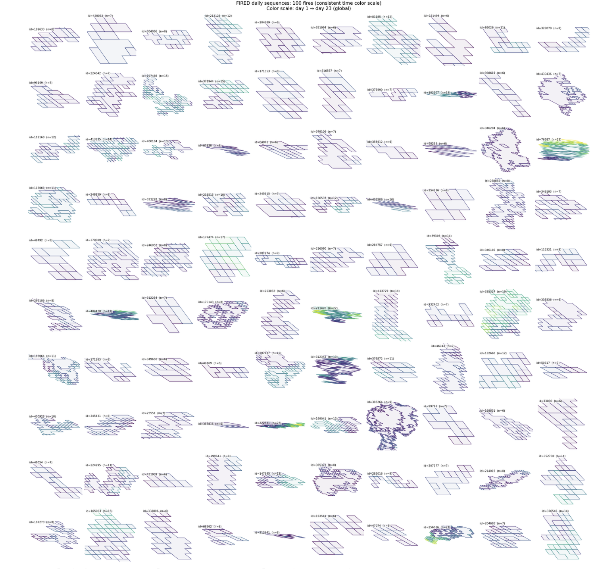

# Transformations & Ecosystem Services Innovation Summit 2025 — Team 11

<a href="https://github.com/CU-ESIIL/transformations-ecosystem-services-innovation-summit-2025__11/edit/main/docs/index.md" title="Edit this page">✏️</a>

<!-- =========================================================
HERO (Swap hero.jpg, title, strapline, and the three links)
========================================================= -->

[Raw photo location: hero.jpg](https://github.com/CU-ESIIL/transformations-ecosystem-services-innovation-summit-2025__11/blob/main/docs/assets/hero.jpg)

**One sentence on impact:** Team 11 is mapping how transformative adaptation strategies can strengthen ecosystem services for communities navigating rapid environmental change.

**[Project brief (PDF)](#) · [View shared code](https://github.com/CU-ESIIL/transformations-ecosystem-services-innovation-summit-2025__11/tree/main/code) · [Data & access](data.md)**

> **About this site:** We document what Team 11 tests and learns during the Transformations & Ecosystem Services Innovation Summit 2025. Edit any section directly in your browser: open a file → pencil icon → Commit changes.

---

## How to use this page (for the team)
- **Edit this file:** `docs/index.md` → ✎ → change text → **Commit changes**.
- **Add images:** upload to `docs/assets/` and reference like `assets/your_file.png`.
- Keep **text short** and **visuals first**. Think “slide captions,” not essays.

---

## Day 1 — Define & Explore
*Focus: questions, hypotheses, context; add at least one visual (photo of whiteboard/notes).*

### Our product 📣
- Summit-ready homepage that highlights actionable insights and next steps for decision makers.

### Our question(s) 📣
- How are ecosystem services shifting in regions experiencing transformational adaptation efforts?
- Which indicators resonate most with local partners and policy stakeholders?
- What rapid analyses help communities compare adaptation scenarios?

### Hypotheses / intentions
- We think that combining field knowledge with open data portals will surface underused resilience indicators.
- We intend to test whether lightweight dashboards can communicate trade-offs faster than static briefs.
- We will know we’re onto something if partners can identify a preferred scenario during the showcase session.

### Why this matters (the “upshot”) 📣
Communities facing intertwined climate and socio-economic stressors need timely evidence to plan investments. A clear synthesis of ecosystem service trends supports more equitable, climate-ready decisions.

### Inspirations (papers, datasets, tools)
- Publication: [IPBES Transformative Change Assessment](https://doi.org/10.5281/zenodo.7418612)
- Dataset portal: [USGS ScienceBase Collections](https://www.sciencebase.gov/catalog/)
- Tool/tech: [Pangeo Forge](https://pangeo-forge.org/)

### Field notes / visuals

[Raw photo location: day1_whiteboard.jpg](https://github.com/CU-ESIIL/transformations-ecosystem-services-innovation-summit-2025__11/blob/main/docs/assets/day1_whiteboard.jpg)
*Caption: Drafting initial research questions, available datasets, and stakeholder priorities.*

> **Different perspectives:** Capture alternative framings or tensions—they often reveal the next experiment to run.

---

## Day 2 — Data & Methods
*Focus: what we’re testing and building; show a first visual (plot/map/screenshot/GIF).*

### Data sources we’re exploring 📣
- **Community-scale adaptation actions** – inventory pulled from partner submissions in the Transformations initiative.

  
  [Raw photo location: explore_data_plot.png](https://github.com/CU-ESIIL/transformations-ecosystem-services-innovation-summit-2025__11/blob/main/docs/assets/explore_data_plot.png)
  *Snapshot showing preliminary clustering of adaptation actions by ecosystem service focus.*

- **Ecosystem condition indicators** – in-development tilesets from the [ESIIL Data Commons](https://github.com/CU-ESIIL).

### Methods / technologies we’re testing 📣
- Rapid change detection on composite remote-sensing indicators.
- Participatory weighting of metrics with summit stakeholders.
- Lightweight dashboards served from notebooks for quick iteration.

### Challenges identified
- Aligning spatial resolution across community-reported and remote-sensing datasets.
- Limited time to validate indicator thresholds with partners.
- Need a clear way to publish reproducible notebooks post-summit.

### Visuals
#### Static figure

[Raw photo location: figure1.png](https://github.com/CU-ESIIL/transformations-ecosystem-services-innovation-summit-2025__11/blob/main/docs/assets/figure1.png)
*Figure 1.* Overlay of adaptation actions and ecosystem service change hotspots.

#### Animated change (GIF)

[Raw photo location: change.gif](https://github.com/CU-ESIIL/transformations-ecosystem-services-innovation-summit-2025__11/blob/main/docs/assets/change.gif)
*Figure 2.* Animated change in vegetation productivity across the pilot region.

#### Interactive map (iframe)
<iframe
  title="Study area (OpenStreetMap)"
  src="https://www.openstreetmap.org/export/embed.html?bbox=-105.35%2C39.90%2C-105.10%2C40.10&layer=mapnik&marker=40.000%2C-105.225"
  width="100%" height="360" frameborder="0"></iframe>

<a href="https://www.openstreetmap.org/?mlat=40.000&mlon=-105.225#map=12/40.0000/-105.2250">Open full map</a>

> If an embed doesn’t load, put the normal link directly under it.

---

## Final Share Out — Insights & Sharing
*Focus: synthesis; highlight 2–3 visuals that tell the story; keep text crisp. Practice a 2-minute walkthrough of the homepage 📣: Why → Questions → Data/Methods → Findings → Next.*

[Raw photo location: team_photo.jpg](https://github.com/CU-ESIIL/transformations-ecosystem-services-innovation-summit-2025__11/blob/main/docs/assets/team_photo.jpg)

### Findings at a glance 📣
- Headline 1 — Ecosystem service gains align with co-produced adaptation plans.
- Headline 2 — Communities prioritizing equity indicators show faster uptake of nature-based solutions.
- Headline 3 — Shared dashboards accelerate partner decision timelines by outlining trade-offs.

### Visuals that tell the story 📣

[Raw photo location: fire_hull.png](https://github.com/CU-ESIIL/transformations-ecosystem-services-innovation-summit-2025__11/blob/main/docs/assets/fire_hull.png)
*Visual 1.* Highlighting regions where adaptation planning coincides with improved ecosystem service scores.

[Raw photo location: hull_panels.png](https://github.com/CU-ESIIL/transformations-ecosystem-services-innovation-summit-2025__11/blob/main/docs/assets/hull_panels.png)
*Visual 2.* Comparative view of community feedback and model outputs.

[Raw photo location: main_result.png](https://github.com/CU-ESIIL/transformations-ecosystem-services-innovation-summit-2025__11/blob/main/docs/assets/main_result.png)
*Visual 3.* Time-series chart summarizing service trajectories before and after adaptation investments.

<iframe
  title="Short explainer video (optional)"
  width="100%" height="360"
  src="https://www.youtube.com/embed/ASTGFZ0d6Ps"
  frameborder="0" allow="accelerometer; autoplay; clipboard-write; encrypted-media; gyroscope; picture-in-picture; web-share"
  allowfullscreen></iframe>

### What’s next? 📣
- Immediate follow-ups: finalize reproducible notebooks and share storage links with summit organizers.
- What we would do with one more month: validate indicators with additional partner communities and expand to new geographies.
- Who should see this next: summit steering committee, agency collaborators, and on-the-ground practitioners.

---

## Featured links (image buttons)
<table>
<tr>
<td align="center" width="33%">
  <a href="#"> <strong>Read the brief</strong></a>
</td>
<td align="center" width="33%">
  <a href="https://github.com/CU-ESIIL/transformations-ecosystem-services-innovation-summit-2025__11/blob/main/code/fired_time_hull_panel.ipynb"> <strong>View code</strong></a>
</td>
<td align="center" width="33%">
  <a href="https://github.com/CU-ESIIL/transformations-ecosystem-services-innovation-summit-2025__11/blob/main/code/single_hull_demo.py"> <strong>Explore data</strong></a>
</td>
</tr>
</table>

---

## Team
| Name | Role | Contact | GitHub |
|------|------|---------|--------|
| Add your name | Summit lead | you@example.org | @github-handle |
| Add your collaborator | Data & analysis | collaborator@example.org | @collaborator |

---

## Storage

Code
Keep shared scripts, notebooks, and utilities in the [`code/`](https://github.com/CU-ESIIL/transformations-ecosystem-services-innovation-summit-2025__11/tree/main/code) directory. Document how to run them in a README or within the files so teammates and visitors can reproduce your workflow.

Documentation
Use the [`docs/`](https://github.com/CU-ESIIL/transformations-ecosystem-services-innovation-summit-2025__11/tree/main/docs) folder to publish project updates on this site. Longer internal notes can live in [`documentation/`](https://github.com/CU-ESIIL/transformations-ecosystem-services-innovation-summit-2025__11/tree/main/documentation); summarize key takeaways here so the public story stays current.

---

## Cite & reuse
If you use these materials, please cite:

> ESIIL Team 11. (2025). *Transformations & Ecosystem Services Innovation Summit 2025 — Team 11*. Retrieved from https://github.com/CU-ESIIL/transformations-ecosystem-services-innovation-summit-2025__11

License: CC-BY-4.0 unless noted. See dataset licenses on the **[Data](data.md)** page.

---

<!-- EDIT HINTS
- Upload images to docs/assets/ and reference as assets/filename.png
